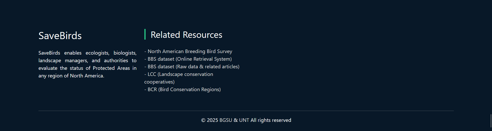

<h1 align="center">SaveBirds.app Footer Section</h1>

# 1. Overview
Create the Footer section for SaveBirds.app using Vue 3 and Bootstrap 5. This footer should appear consistently across all pages of the application and provide important reference links, attribution information, and resources related to bird conservation data.

# 2. Design Requirements

## 2.1. Layout Structure
The Footer should consist of the following elements:
- **Container**: Full-width dark background container
- **Reference Links**: Links to data sources and related resources
- **Attribution**: Credit information and copyright notices (if applicable)

## 2.2. Visual Reference


# 3. Component Specifications

## 3.1. Container
- **Background**: Dark (Bootstrap's bg-dark or similar)
- **Text Color**: Light/white text for contrast against dark background
- **Width**: Full-width of the viewport
- **Padding**: Appropriate padding on all sides (typically more top/bottom than left/right)
- **Margin**: Top margin to separate from page content
- **Position**: Always at the bottom of the page, not fixed

## 3.2. Reference Links Section

### 3.2.1. Resource Links
Implement the following resource links in the footer:

| Resource Title                            | Link URL                                                          |
|-------------------------------------------|-------------------------------------------------------------------|
| North American Breeding Bird Survey       | https://www.pwrc.usgs.gov/bbs/index.cfm                           |
| BBS dataset (Online Retrieval System)     | https://www.pwrc.usgs.gov/BBS/RawData/                            |
| BBS dataset (Raw data & related articles) | https://www.sciencebase.gov/catalog/item/52b1dfa8e4b0d9b325230cd9 |
| LCC (Landscape conservation cooperatives) | https://www.sciencebase.gov/catalog/item/4fbbd87be4b0ee66f48f66f3 |
| BCR (Bird Conservation Regions)           | https://nabci-us.org/resources/bird-conservation-regions-map/     |

- **Link Styling**:
  - Color: Blue or light blue text to contrast with dark background
  - Hover Effect: Slightly lighter shade or underline on hover
  - Target: All links should open in a new tab (_blank)
  - Security: Include rel="noopener noreferrer" for security

### 3.2.2. Links Implementation
- **Layout Options**:
  - Option 1: Horizontal row of links with appropriate spacing
  - Option 2: Multiple columns of links, grouped by category
  - Option 3: Single column with clear separation between links
  - Recommended: Choose layout based on number of links and available space

- **Accessibility**:
  - Include appropriate aria-labels for all links
  - Ensure sufficient color contrast for readability
  - Provide title attributes for tooltips on hover

## 3.3. Attribution Section
- **Content**: Brief attribution text acknowledging data sources
- **Position**: Below the reference links
- **Styling**: Smaller font size, subtle but readable
- **Elements**:
  - Copyright information (if applicable)
  - Brief acknowledgment of data providers
  - Year or date range of validity

# 4. Responsive Behavior
- **Desktop View**:
  - Links may be arranged horizontally or in multiple columns
  - Comfortable spacing between elements
  - Full attribution section visible

- **Tablet View**:
  - Links may adjust to fewer columns
  - Maintained spacing for touch targets
  - Full attribution text preserved

- **Mobile View**:
  - Links may stack vertically for better mobile viewing
  - Increased touch target size for links
  - Condensed spacing to fit smaller screen
  - Attribution text may be shortened if necessary

# 5. Implementation Notes
- Create as a Vue component in `components/layout/AppFooter.vue`
- Use Bootstrap 5 for layout and styling
- Import and register the component in the main App.vue file
- Ensure the footer stays at the bottom of the page, even when content is short
- Use flexbox or grid for responsive link layout
- Test across different viewport sizes to ensure proper appearance
- Implement proper accessibility attributes for all interactive elements

# 6. Component Structure
```vue
<template>
  <footer class="footer bg-dark text-white py-4 mt-4">
    <div class="container">
      <!-- Links Section -->
      <div class="row mb-3">
        <!-- Resource Links -->
        <!-- Implementation choice: columns, horizontal list, etc. -->
      </div>
      
      <!-- Attribution Section -->
      <div class="row">
        <div class="col">
          <p class="small text-muted">
            <!-- Attribution text -->
          </p>
        </div>
      </div>
    </div>
  </footer>
</template>

<script>
export default {
  name: 'AppFooter',
  data() {
    return {
      resources: [
        {
          title: 'North American Breeding Bird Survey',
          url: 'https://www.pwrc.usgs.gov/bbs/index.cfm'
        },
        {
          title: 'BBS dataset (Online Retrieval System)',
          url: 'https://www.pwrc.usgs.gov/BBS/RawData/'
        },
        {
          title: 'BBS dataset (Raw data & related articles)',
          url: 'https://www.sciencebase.gov/catalog/item/52b1dfa8e4b0d9b325230cd9'
        },
        {
          title: 'LCC (Landscape conservation cooperatives)',
          url: 'https://www.sciencebase.gov/catalog/item/4fbbd87be4b0ee66f48f66f3'
        },
        {
          title: 'BCR (Bird Conservation Regions)',
          url: 'https://nabci-us.org/resources/bird-conservation-regions-map/'
        }
      ]
    }
  }
}
</script>
```

# 7. CSS Considerations
- Use Bootstrap classes wherever possible
- For custom styling, consider:
  ```css
  /* Footer always at bottom even with short content */
  #app {
    display: flex;
    flex-direction: column;
    min-height: 100vh;
  }

  main {
    flex: 1;
  }

  /* Link styling */
  .footer a {
    color: #8bb9fe; /* Light blue example */
    text-decoration: none;
    transition: color 0.2s ease;
  }

  .footer a:hover {
    color: #ffffff;
    text-decoration: underline;
  }
  ```

# 8. Technical Notes
- Ensure all links include target="_blank" and rel="noopener noreferrer"
- Track outbound link clicks if analytics is implemented
- Test all links for proper functionality
- Consider adding a "back to top" button if pages are long
- Ensure the footer remains accessible when using keyboard navigation
